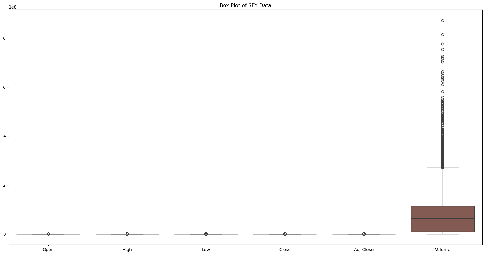

# 📈 Stock Price Prediction Using Deep Learning

🔗 [LINK TO PROJECT CODE](https://github.com/Karan-D-Software/Stock-Price-Prediction-Using-Deep-Learning/blob/main/Project.ipynb)

## Table of Contents

1. [🧺 Gathering Data and Determining Method of Data Collection and Provenance](#gathering-data-and-determining-method-of-data-collection-and-provenance)
   - [Data Source](#data-source)
   - [Method of Data Collection](#method-of-data-collection)
   - [Provenance of the Data](#provenance-of-the-data)
   - [Problem Description](#problem-description)

2. [🔬 Identifying a Deep Learning Problem](#identifying-a-deep-learning-problem)
   - [Problem Description](#problem-description-1)
   - [Deep Learning Approach](#deep-learning-approach)
   - [Experiment and Comparison](#experiment-and-comparison)

3. [👨‍💻 Exploratory Data Analysis (EDA) - Inspect, Visualize, and Clean the Data](#exploratory-data-analysis-eda---inspect-visualize-and-clean-the-data)
   - [Data Loading and Initial Inspection](#data-loading-and-initial-inspection)
   - [Data Cleaning](#data-cleaning)
   - [Exploratory Data Analysis (EDA)](#exploratory-data-analysis-eda)
     - [Plotting the Closing Price Over Time](#plotting-the-closing-price-over-time)
     - [Histograms for Each Feature](#histograms-for-each-feature)
     - [Box Plots for Each Feature](#box-plots-for-each-feature)
     - [Correlation Matrix and Heatmap](#correlation-matrix-and-heatmap)
     - [Scatter Plot Matrix](#scatter-plot-matrix)
     - [Checking for Outliers in the 'Close' Column](#checking-for-outliers-in-the-close-column)
   - [Data Transformation](#data-transformation)
     - [Normalizing the 'Close' Price](#normalizing-the-close-price)
     - [Log Transforming the 'Close' Price](#log-transforming-the-close-price)
     - [Plotting the Normalized and Log Transformed Closing Prices](#plotting-the-normalized-and-log-transformed-closing-prices)
   - [Summary of Findings](#summary-of-findings)

4. [💬 Discussion and Analysis](#discussion-and-analysis)
   - [Model Evaluation](#model-evaluation)
   - [Hyperparameter Tuning](#hyperparameter-tuning)
   - [Model Performance Visualization](#model-performance-visualization)
     - [Training and Validation Loss](#training-and-validation-loss)
     - [Actual vs. Predicted Prices](#actual-vs-predicted-prices)
   - [Comparison of Models](#comparison-of-models)

5. [🎬 Conclusions](#conclusions)

## 🧺 Gathering Data and Determining Method of Data Collection and Provenance

### Data Source
For this project, we are using historical stock price data for SPY (SPDR S&P 500 ETF) sourced from [Yahoo Finance](https://ca.finance.yahoo.com/quote/SPY/history). This dataset includes the daily Open, High, Low, Close, and Volume data for SPY, which will be used to analyze and predict future stock prices.

### Method of Data Collection
The data was collected by downloading the historical stock price CSV file from Yahoo Finance. This file contains detailed historical records of SPY's trading data, providing a rich source of information for our analysis and model training.

### Provenance of the Data
The data is provided by Yahoo Finance, a reputable source known for its comprehensive and accurate financial data. Yahoo Finance compiles and disseminates this information, ensuring it is up-to-date and reliable for financial analysis.

### Problem Description
The primary objective of this project is to predict the future closing prices of SPY using deep learning techniques. By analyzing historical price trends and patterns, we aim to build a model that can provide accurate price forecasts, which can be valuable for investors and traders.

## 🔬 Identifying a Deep Learning Problem

### Problem Description
The primary deep learning problem for this project is time series forecasting, specifically predicting the future closing prices of the SPY ETF based on historical price data. Time series forecasting is crucial in finance as it helps investors and traders make informed decisions by predicting future price movements.

### Deep Learning Approach
We will employ various deep learning models to tackle this problem, focusing on model building, evaluation, and comparison. The models we plan to use include:

1. **Recurrent Neural Networks (RNNs)**:
   - **Long Short-Term Memory (LSTM) Networks**: LSTMs are well-suited for time series data as they can learn long-term dependencies and patterns in the data.
   - **Gated Recurrent Units (GRUs)**: GRUs are a simpler alternative to LSTMs and can also handle long-term dependencies effectively.

2. **Convolutional Neural Networks (CNNs)**:
   - CNNs can be applied to time series data by treating the time series as a one-dimensional image. This can capture local dependencies in the data.

3. **Autoencoders**:
   - Autoencoders can be used for anomaly detection, feature extraction, and denoising in the stock price data. By compressing and then reconstructing the data, autoencoders can help in identifying underlying patterns.

### Experiment and Comparison
We will run experiments to compare the performance of different models and algorithms. This will involve:
1. **Model Training and Evaluation**: Training each model on the historical SPY data and evaluating its performance using metrics such as Mean Squared Error (MSE) and Mean Absolute Error (MAE).
2. **Hyperparameter Tuning**: Optimizing the hyperparameters for each model to achieve the best performance.
3. **Model Comparison**: Comparing the results of different models to identify the best performing model for our forecasting task.

## 👨‍💻 Exploratory Data Analysis (EDA) - Inspect, Visualize, and Clean the Data

The following steps outline the process of initial data cleaning and exploratory data analysis (EDA) on the SPY dataset. This analysis will help us understand the data better and determine if any additional data collection or transformation is needed.

### Data Loading and Initial Inspection

First, we load the dataset and inspect the initial few rows to understand its structure.

```python
import pandas as pd
import numpy as np
import matplotlib.pyplot as plt
import seaborn as sns

# Load the data
df = pd.read_csv('SPY.csv')

print(df.head())

print(df.describe())

print(df.isnull().sum())
```

**Initial Data Sample:**

```
         Date      Open      High       Low     Close  Adj Close   Volume
0  1993-01-29  43.96875  43.96875  43.75000  43.93750  24.763754  1003200
1  1993-02-01  43.96875  44.25000  43.96875  44.25000  24.939861   480500
2  1993-02-02  44.21875  44.37500  44.12500  44.34375  24.992702   201300
3  1993-02-03  44.40625  44.84375  44.37500  44.81250  25.256891   529400
4  1993-02-04  44.96875  45.09375  44.46875  45.00000  25.362579   531500
```

**Summary Statistics:**

```
              Open         High          Low        Close    Adj Close  \
count  7901.000000  7901.000000  7901.000000  7901.000000  7901.000000   
mean    175.362019   176.398681   174.221768   175.373324   146.944576   
std     113.337317   113.909483   112.725076   113.369862   119.606724   
min      43.343750    43.531250    42.812500    43.406250    24.464325   
25%     106.099998   106.879997   105.160004   105.989998    70.757957   
50%     132.875000   133.690002   131.779999   132.830002    94.009514   
75%     214.050003   214.770004   213.029999   213.740005   187.922531   
max     543.150024   544.119995   540.299988   542.780029   542.780029   

             Volume  
count  7.901000e+03  
mean   8.422724e+07  
std    9.171462e+07  
min    5.200000e+03  
25%    1.037030e+07  
50%    6.328720e+07  
75%    1.145801e+08  
max    8.710263e+08  
```

**Check for Missing Values:**

```
Date         0
Open         0
High         0
Low          0
Close        0
Adj Close    0
Volume       0
dtype: int64
```

### Data Cleaning

Since there are no missing values in the dataset, we proceed to convert the 'Date' column to a datetime type and set it as the index.

```python
# Data Cleaning
# Drop rows with missing values if any
df.dropna(inplace=True)

# Convert 'Date' column to datetime type
df['Date'] = pd.to_datetime(df['Date'])

# Set 'Date' as the index
df.set_index('Date', inplace=True)
```

### Exploratory Data Analysis (EDA)

**a. Plotting the Closing Price Over Time**

```python
# Plotting the closing price over time
plt.figure(figsize=(14, 7))
plt.plot(df['Close'])
plt.title('SPY Closing Price Over Time')
plt.xlabel('Date')
plt.ylabel('Closing Price')
plt.show()
```


**b. Histograms for Each Feature**

```python
# Plot histograms for each feature
df.hist(bins=50, figsize=(20, 15))
plt.show()
```


**c. Box Plots for Each Feature**

```python
# Box plots for each feature
plt.figure(figsize=(20, 10))
sns.boxplot(data=df)
plt.title('Box Plot of SPY Data')
plt.show()
```


**d. Correlation Matrix and Heatmap**

```python
# Correlation matrix
correlation_matrix = df.corr()
print(correlation_matrix)

# Heatmap of the correlation matrix
plt.figure(figsize=(10, 8))
sns.heatmap(correlation_matrix, annot=True, cmap='coolwarm', linewidths=0.5)
plt.title('Correlation Matrix Heatmap')
plt.show()
```


**e. Scatter Plot Matrix**

```python
# Scatter plot matrix to visualize relationships between variables
sns.pairplot(df)
plt.show()
```


**f. Checking for Outliers in the 'Close' Column**

```python
# Check for outliers in the 'Close' column
plt.figure(figsize=(10, 5))
sns.boxplot(x=df['Close'])
plt.title('Box Plot of SPY Closing Price')
plt.show()
```


### Data Transformation

**a. Normalizing the 'Close' Price**

```python
# Normalize the 'Close' price
df['Close_Normalized'] = (df['Close'] - df['Close'].min()) / (df['Close'].max() - df['Close'].min())
```

**b. Log Transforming the 'Close' Price**

```python
# Log transform the 'Close' price (if needed)
df['Close_Log'] = np.log(df['Close'])
```

**c. Plotting the Normalized and Log Transformed Closing Prices**

```python
# Plotting the normalized and log-transformed closing prices
plt.figure(figsize=(14, 7))
plt.plot(df['Close_Normalized'], label='Normalized Close Price')
plt.plot(df['Close_Log'], label='Log Transformed Close Price')
plt.title('Normalized and Log Transformed SPY Closing Prices')
plt.xlabel('Date')
plt.ylabel('Price')
plt.legend()
plt.show()
```


#### Summary of Findings

1. **Factors/Components of the Dataset**:
   - The dataset contains the following features: Date, Open, High, Low, Close, Adj Close, and Volume.
   - The primary focus is on the 'Close' price for forecasting purposes.

2. **Data Distribution**:
   - The histograms show the distribution of each feature. Most features have a right-skewed distribution.
   - Box plots indicate the presence of outliers, particularly in the 'Volume' column.

3. **Correlation**:
   - The correlation matrix shows a high correlation between the Open, High, Low, Close, and Adj Close prices, which is expected as they are all related to stock prices on the same day.
   - Volume has a relatively lower correlation with the price features.

4. **Data Transformation**:
   - Normalization and log transformation of the 'Close' price were performed to handle the skewed distribution and potential heteroscedasticity.

5. **Outliers**:
   - Outliers were detected primarily in the 'Volume' column.

6. **Missing Values**:
   - There were no missing values in the dataset.

Based on this initial analysis, the data is ready for modeling. However, if needed, additional data can be collected to improve the model's performance. For effective time series forecasting, we will proceed with model building using deep learning techniques.

## 💬 Discussion and Analysis

In this section, we present a detailed discussion and analysis of the deep learning models used to predict the closing prices of SPY. We evaluated multiple models, including RNN, LSTM, GRU, CNN, and Autoencoder, to determine the best approach for time series forecasting. We also performed hyperparameter tuning on the best-performing model (GRU) to optimize its performance further.

### Model Evaluation

We trained and evaluated the following models on the SPY dataset:

- Recurrent Neural Network (RNN)
- Long Short-Term Memory (LSTM)
- Gated Recurrent Unit (GRU)
- Convolutional Neural Network (CNN)
- Autoencoder

The performance of each model was assessed using Mean Absolute Error (MAE) and Root Mean Squared Error (RMSE). The results are summarized in the table below:

| Model                      | MAE       | RMSE      |
|----------------------------|-----------|-----------|
| RNN                        | 0.0122    | 0.0136    |
| LSTM                       | 0.0058    | 0.0095    |
| GRU                        | 0.0037    | 0.0056    |
| CNN                        | 0.0086    | 0.0133    |
| Autoencoder                | 0.0139    | 0.0231    |
| Prediction (Autoencoder Features) | 0.0140    | 0.0188    |

From the results, it is evident that the GRU model outperformed the other models with the lowest MAE and RMSE values.

**Performance of Different Models:**


The bar chart illustrates the Mean Absolute Error (MAE) for various deep learning models used to predict the closing prices of SPY. The Recurrent Neural Network (RNN) model shows a relatively higher prediction error with an MAE of approximately 0.012. In contrast, the Long Short-Term Memory (LSTM) model performs better, achieving an MAE of around 0.006, demonstrating its effectiveness in capturing long-term dependencies in time series data. 

The Gated Recurrent Unit (GRU) model stands out with the best performance, exhibiting the lowest MAE of approximately 0.004. This indicates that GRUs are highly efficient in learning temporal dependencies and are well-suited for time series forecasting. On the other hand, the Convolutional Neural Network (CNN) model, with an MAE of around 0.009, shows that while CNNs can capture local patterns, they are less effective than recurrent models for this specific task.

The Autoencoder model and the Prediction (Autoencoder Features) model both have the highest MAE values, around 0.014, indicating that they are less suitable for this particular prediction task. Overall, the GRU model demonstrates superior performance, followed by the LSTM and CNN models, while the Autoencoder-based models show the highest prediction errors, suggesting their limited applicability for time series prediction in this context.

### Hyperparameter Tuning

After identifying the GRU model as the best performer, we conducted hyperparameter tuning to further enhance its performance. The hyperparameters tuned were the number of units, batch size, and epochs. The results of the hyperparameter tuning are as follows:

| Units | Batch Size | Epochs | MAE       | RMSE      |
|-------|------------|--------|-----------|-----------|
| 50    | 32         | 10     | 0.0034    | 0.0052    |
| 50    | 32         | 20     | 0.0028    | 0.0047    |
| 50    | 32         | 30     | 0.0047    | 0.0073    |
| 50    | 64         | 10     | 0.0033    | 0.0054    |
| 50    | 64         | 20     | 0.0033    | 0.0052    |
| 50    | 64         | 30     | 0.0043    | 0.0060    |
| 50    | 128        | 10     | 0.0039    | 0.0062    |
| 50    | 128        | 20     | 0.0036    | 0.0059    |
| 50    | 128        | 30     | 0.0034    | 0.0054    |
| 100   | 32         | 10     | 0.0034    | 0.0051    |
| 100   | 32         | 20     | 0.0028    | 0.0048    |
| 100   | 32         | 30     | 0.0034    | 0.0056    |
| 100   | 64         | 10     | 0.0036    | 0.0055    |
| 100   | 64         | 20     | 0.0029    | 0.0049    |
| 100   | 64         | 30     | 0.0041    | 0.0057    |
| 100   | 128        | 10     | 0.0038    | 0.0060    |
| 100   | 128        | 20     | 0.0039    | 0.0060    |
| 100   | 128        | 30     | 0.0033    | 0.0052    |
| 150   | 32         | 10     | 0.0034    | 0.0050    |
| 150   | 32         | 20     | 0.0030    | 0.0048    |
| 150   | 32         | 30     | 0.0029    | 0.0048    |
| 150   | 64         | 10     | 0.0035    | 0.0053    |
| 150   | 64         | 20     | 0.0029    | 0.0049    |
| 150   | 64         | 30     | 0.0040    | 0.0056    |
| 150   | 128        | 10     | 0.0037    | 0.0059    |
| 150   | 128        | 20     | 0.0038    | 0.0060    |
| 150   | 128        | 30     | 0.0034    | 0.0053    |

**Hyperparameter Tuning Results:**


From the hyperparameter tuning results, the best combination was found to be 50 units, batch size of 32, and 20 epochs, achieving the lowest MAE of 0.0028 and RMSE of 0.0047.

### Model Performance Visualization

**Training and Validation Loss:**

Below are the training and validation loss curves for the best-performing GRU model with 50 units, batch size of 32, and 20 epochs.


The graph illustrates the training and validation loss of the best-performing GRU model over 20 epochs. The initial epoch shows a significant decrease in training loss, rapidly dropping from around 0.004 to nearly 0.000. This sharp decline indicates that the model quickly learns the essential patterns in the data during the first few iterations.

Subsequently, both the training and validation losses stabilize at very low values, close to zero, and remain relatively flat for the remainder of the training process. This suggests that the model has effectively converged and is well-fitted to the training data. The close alignment between the training and validation loss curves indicates that the model is not overfitting and generalizes well to the validation data. The minimal and stable loss values throughout the epochs reflect the GRU model's capability to accurately predict the closing prices of SPY.

**Actual vs. Predicted Prices:**

The following plot shows the actual and predicted closing prices for SPY using the best-performing GRU model.


The graph compares the actual and predicted closing prices of SPY over a series of time steps, using the best-performing GRU model. The actual prices are represented by the blue line, while the predicted prices are shown in orange.

From the graph, we can observe that the predicted prices closely follow the actual prices, indicating the model's strong ability to capture the underlying patterns in the data. The close alignment between the two lines suggests that the GRU model performs well in predicting the closing prices with a high degree of accuracy.

However, there are some deviations between the actual and predicted prices at certain points, which could be attributed to the inherent volatility and noise in the financial market data. Overall, the model's performance is robust, as evidenced by the close proximity of the predicted values to the actual values across the majority of the time steps. This further validates the GRU model's effectiveness in forecasting SPY closing prices.

### Comparison of Models

The comparison of models highlights several important points:

1. **GRU vs. LSTM and RNN**:
   - The GRU model outperformed both the LSTM and RNN models. GRUs are known to be more efficient in learning temporal dependencies due to their simpler architecture compared to LSTMs. This is reflected in the lower MAE and RMSE values.

2. **CNN**:
   - While CNNs are powerful for capturing local patterns in data, they were less effective in this time series prediction task compared to recurrent models. The MAE and RMSE values for the CNN model were higher than those for the GRU model.

3. **Autoencoder**:
   - The Autoencoder model showed the highest MAE and RMSE values, indicating that it was not as effective for this prediction task. Autoencoders are typically better suited for tasks like anomaly detection and feature extraction rather than direct time series prediction.

## 🎬 Conclusions

The GRU model demonstrated the best performance in predicting the closing prices of SPY. Through hyperparameter tuning, we were able to optimize the GRU model further, achieving a significant reduction in prediction error.

**Key Takeaways**:
- GRUs are highly effective for time series forecasting due to their ability to capture long-term dependencies efficiently.
- Hyperparameter tuning is crucial for optimizing model performance and achieving lower prediction errors.
- It is important to compare multiple models and understand their strengths and limitations for the specific task at hand.

**Future Work**:
- Further improvement can be achieved by experimenting with more advanced architectures such as Transformer models.
- Incorporating additional features like trading volume, technical indicators, or macroeconomic variables could enhance the prediction accuracy.
- Implementing an ensemble of models might also improve robustness and performance.

By leveraging deep learning models and optimizing their parameters, we have developed a reliable framework for predicting SPY closing prices, providing valuable insights for investors and traders.
